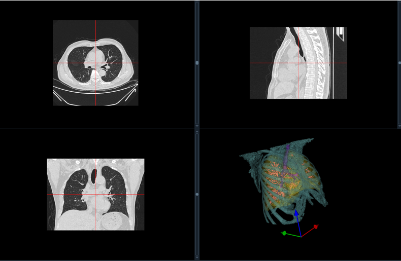
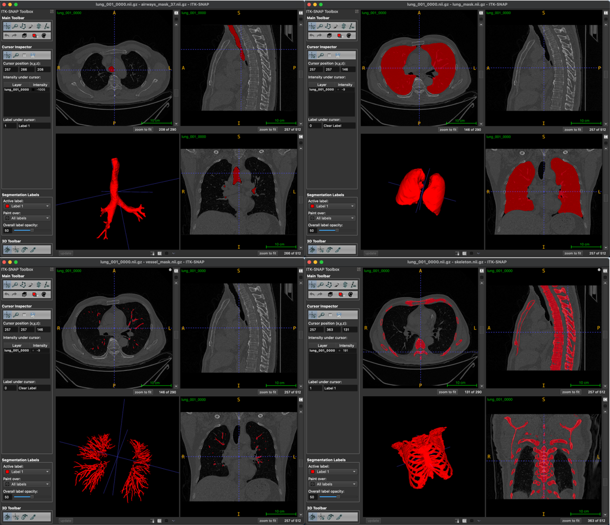

## Lung Organ Segmentation: A Comprehensive Python Project

English | [简体中文](./README_CN.md) 

This repository provides a Python-based implementation for segmenting various organs within the lungs using medical imaging data, specifically focusing on CT scans. The project leverages the SimpleITK library for image processing and analysis, along with other supporting libraries like NumPy and scikit-image.



### Key Features:

* **Multi-organ Segmentation:** The project segments various structures within the lungs, including:
    * Airways (trachea and bronchi)
    * Lung parenchyma
    * Blood vessels
    * Skin surface
    * Bones
* **Algorithm Variety:** Different segmentation algorithms are employed based on the target structure:
    * **Region Growing:** Used for segmenting airways by iteratively grouping voxels based on intensity similarity.
    * **Confidence Connected:** Employed for lung parenchyma segmentation by growing regions from seed points with confidence values.
    * **Thresholding and Morphological Operations:** Utilized for segmenting blood vessels, skin, and bones by applying intensity thresholds and morphological filters.
* **Flexibility:** The project allows for customization through parameters such as seed points, thresholds, and morphological kernel sizes.

### Project Structure:

The project consists of several Python scripts, each dedicated to specific segmentation tasks:

* **airway_lung_seg.py:** Implements functions for segmenting airways and lung parenchyma.
* **vessel_seg.py:** Contains functions for blood vessel segmentation.
* **skin_seg.py:** Provides functions for skin surface segmentation.
* **skeleton_seg.py:** Implements functions for bone segmentation.
* **utils.py:** Includes helper functions used across different scripts.
* **main.py:** Serves as the main script that orchestrates the entire segmentation pipeline.

### Getting Started:

1. **Dependencies:** Ensure you have the required libraries installed:
    ```bash
    pip install SimpleITK numpy scikit-image
    ```
2. **Data:** Place your lung CT scan (in NIfTI format) in the `dataset` folder.
3. **Configuration:** Adjust parameters within `main.py` as needed, including:
    * `input_path`: Path to your CT scan file.
    * `seed`: Seed point for airway segmentation.
    * `bone_lowerThreshold`: Threshold for bone segmentation.
4. **Execution:** Run the main script:
    ```bash
    python main.py
    ```
5. **Output:** Segmented masks for each organ will be saved in the `output` folder.

### Additional Notes:

* The project is designed for research and educational purposes.
* Fine-tuning of parameters may be required depending on the specific characteristics of your CT scan data.
* The provided seed points and thresholds serve as a starting point and may need adjustments.
* Consider exploring different segmentation algorithms and techniques for further improvement.

### Contributing:

Contributions to this project are welcome! Feel free to fork the repository, make improvements, and submit pull requests.