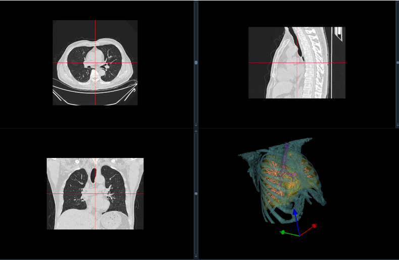
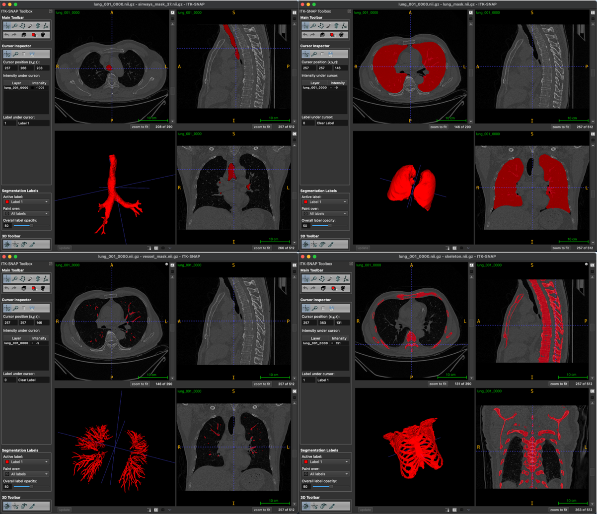

## 肺部器官分割：一个综合的 Python 项目

[English](./README.md) | 简体中文

这个代码库提供了一个基于 Python 的实现，用于分割肺部内的各种器官，特别是针对 CT 扫描的医学影像数据。该项目利用 SimpleITK 库进行图像处理和分析，以及其他支持库，如 NumPy 和 scikit-image。



### 主要功能：

* **多器官分割：** 该项目可以分割肺部内的各种结构，包括：
    * 气道（气管和支气管）
    * 肺实质
    * 血管
    * 皮肤表面
    * 骨骼
* **算法多样性：** 根据目标结构采用不同的分割算法：
    * **区域生长：** 用于分割气道，通过基于强度相似性迭代地分组体素来实现。
    * **置信度连接：** 用于肺实质分割，通过从具有置信度值的种子点生长区域来实现。
    * **阈值和形态学操作：** 用于分割血管、皮肤和骨骼，通过应用强度阈值和形态学滤波器来实现。
* **灵活性：** 该项目允许通过参数进行定制，例如种子点、阈值和形态学内核大小。

### 项目结构：

该项目由几个 Python 脚本组成，每个脚本都专门用于特定的分割任务：

* **airway_lung_seg.py：** 实现分割气道和肺实质的功能。
* **vessel_seg.py：** 包含血管分割的功能。
* **skin_seg.py：** 提供皮肤表面分割的功能。
* **skeleton_seg.py：** 实现骨骼分割的功能。
* **utils.py：** 包含不同脚本使用的辅助函数。
* **main.py：** 作为主脚本，协调整个分割流程。

### 开始使用：

1. **依赖项：** 确保您已安装所需的库：
    ```bash
    pip install SimpleITK numpy scikit-image
    ```
2. **数据：** 将您的肺部 CT 扫描（NIfTI 格式）放在 `dataset` 文件夹中。
3. **配置：** 根据需要调整 `main.py` 中的参数，包括：
    * `input_path`：CT 扫描文件的路径。
    * `seed`：气道分割的种子点。
    * `bone_lowerThreshold`：骨骼分割的阈值。
4. **执行：** 运行主脚本：
    ```bash
    python main.py
    ```
5. **输出：** 每个器官的分割掩膜将保存在 `output` 文件夹中。

### 其他说明：

* 该项目旨在用于研究和教育目的。
* 可能需要根据 CT 扫描数据的具体特征进行参数微调。
* 提供的种子点和阈值作为起点，可能需要调整。
* 考虑探索不同的分割算法和技术以进一步改进。

### 贡献：

欢迎对此项目做出贡献！ 您可以随意 fork 代码库，进行改进并提交拉取请求。